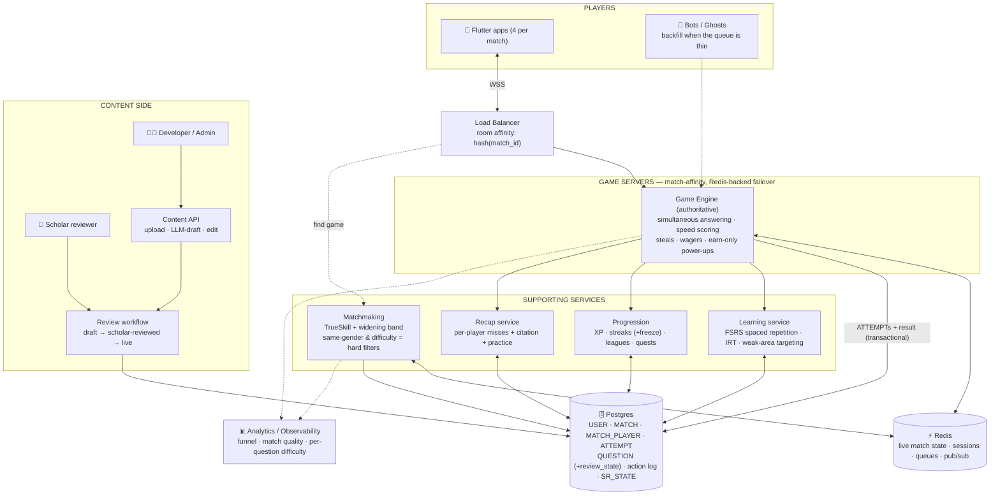
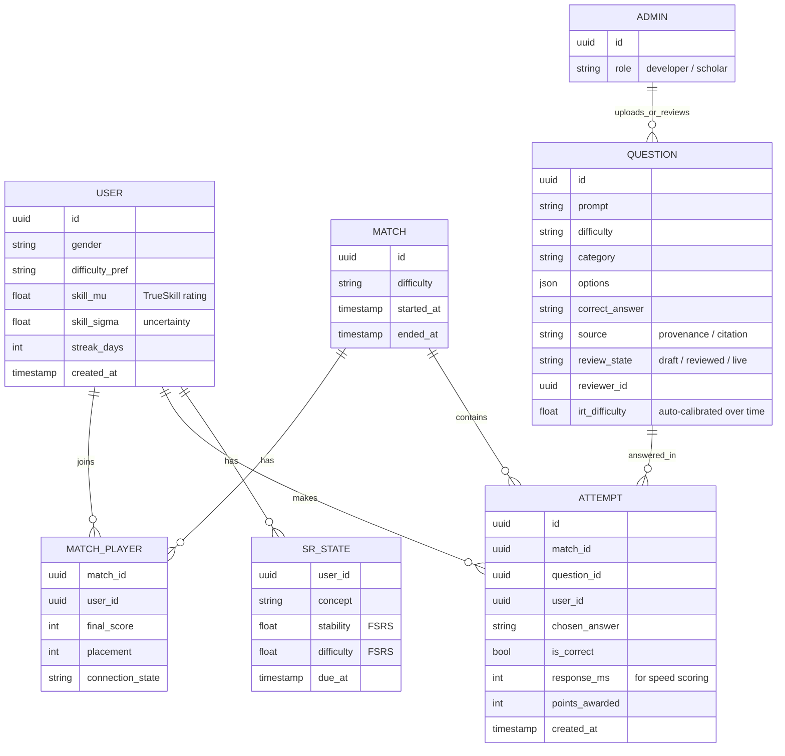
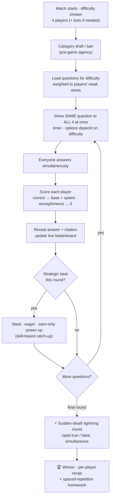
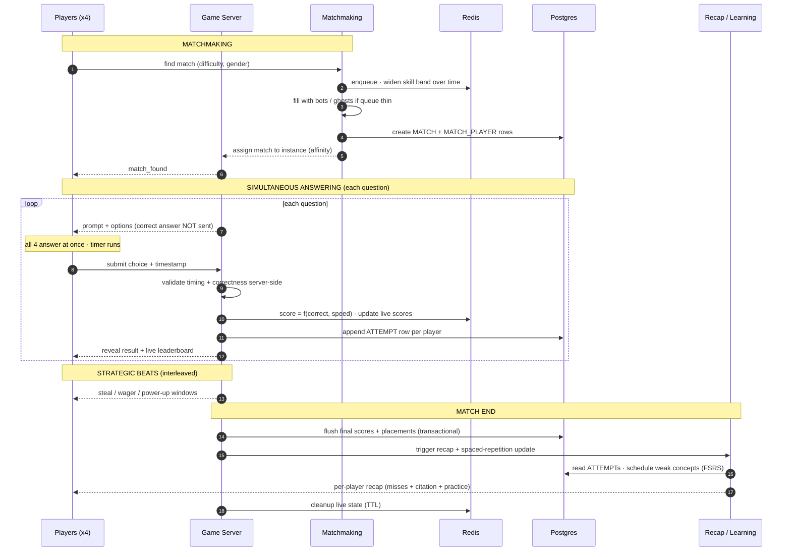

# Islamic Learning Game — Architecture & Build Document

*4-player multiplayer learning game · Flutter + FastAPI (python-socketio) + Redis + Postgres*
*Target: comfortable to ~1,000 concurrent players, with seams to scale further.*

---

## 1. Overview & scope

This document describes the system architecture, data model, game flow, and match lifecycle for the game, after applying the design brief. It also gives a phased build order and a hosting/cost estimate. It intentionally focuses on **architecture and mechanics** — the retention, monetization, and learning-science depth live in the design brief and are referenced here rather than reproduced.

The guiding principle throughout: **the server is the single authority.** The Flutter client renders and captures taps; it holds no rules and is never trusted with anything it could exploit (correct answers, timing, scores).

---

## 2. Core design decisions

Three decisions shape everything below. Two of them reversed earlier drafts, deliberately.

**Simultaneous answering, not turn-based passing.** All four players answer every question at once, scored by correctness *and* speed. Wrong answers and timeouts both score zero. This removes ~75% of dead time and eliminates the perverse incentive where stalling beat guessing. The turn-based tension survives as a **strategic layer** on top — steals, final-round wagers, and earn-only power-ups.

**Room affinity, not pure statelessness.** A match's sockets are routed to one game-server instance via consistent hashing on `match_id`, so live match state stays in-process for speed. Redis holds the authoritative copy as a failover fallback, so an instance dying doesn't lose the match. This is the pragmatic hybrid between "fully stateless" (simple to scale, slower) and "purely in-memory" (fast, fragile).

**The data model is the foundation — build it first.** The `ATTEMPT` table (one row per player, per question) is the keystone. Without it, the per-player recap, spaced repetition, difficulty calibration, and analytics are all impossible. Everything else hangs off this layer.

---

## 3. System architecture

**Reading it.** The phone talks to a load balancer that routes by `match_id` to a game server. The game engine is authoritative — it runs simultaneous answering, speed scoring, and the strategic layer. Redis holds live state and queues; Postgres holds everything durable. Four supporting services (matchmaking, learning, progression, recap) are separate concerns that read/write Postgres. On the content side, every question flows through a scholar-review gate before it can go live. Bots and ghosts backfill matches when there aren't enough live players.

---

## 4. Data model (build this first)

**Why each table earns its place.** `USER` carries the skill rating (TrueSkill `mu`/`sigma`) and streak state. `MATCH_PLAYER` records how each player placed in a given match. `ATTEMPT` is the keystone — every answer, its correctness, response time, and points, which is what makes recap/spaced-repetition/analytics possible. `QUESTION` carries both the `source` (provenance/citation, surfaced to players) and the `review_state` gate, plus an `irt_difficulty` that self-calibrates as real answer data accumulates. `SR_STATE` holds per-player, per-concept spaced-repetition scheduling.

---

## 5. Game flow

**Difficulty rules** (what a player sees, and what a correct answer is worth):

| Level | Options shown | Points per correct |
|-------|--------------|-------------------|
| Easy | Always visible | 20 (base) |
| Medium | Hidden — reveal via lifeline, max 4 per game | 35 (base) |
| Hard | No options — recall the answer | 50 (base) |

Base points are then scaled by speed. Difficulty sets your **baseline option visibility and reveal allowance**; all other power-ups are earned through play and capped at one per question (see Locked Decisions §13.2). So Medium's "4 lifelines" is simply the reveal power-up granted four times at that tier.

---

## 6. Match lifecycle

---

## 7. Server authority & anti-cheat

The one rule that threads through the whole system: **the correct answer never leaves the server before a player has answered.** The client receives only the prompt and options; it submits a choice; the server validates correctness and timing and returns the result. If the answer were sent up front, it could be read straight from network traffic.

Supporting rules: the server stamps question-send and answer-receive times and rejects late answers (with a small latency grace) rather than trusting client-reported timing; every action is validated against server state; submissions are rate-limited and deduplicated via idempotency keys so a retry never double-applies.

---

## 8. Disconnect & reconnect

Live match state is stored in Redis keyed by `match_id`. On reconnect, the player re-subscribes and the server replays current state as a snapshot. A grace period runs before a player is marked abandoned; past that, a bot substitutes or missed questions score zero. All message handling is idempotent, so a reconnect-and-resend can't double-apply an answer. Mobile connections drop constantly, so this path is a first-class feature, not an edge case.

---

## 9. Matchmaking & cold-start

Matchmaking uses a skill rating with uncertainty — **TrueSkill**, which fits 4-player free-for-all better than Elo (built for 1v1). New players start with high uncertainty and update fast for their first several matches, then settle. The skill band starts tight and **widens the longer a player waits** — a good match that never fills is worse than a slightly uneven one that starts in twenty seconds. Same-gender and difficulty are **non-relaxable filters**; only the skill band relaxes.

Cold-start (too few concurrent players to fill a 4-player match) is the hardest early problem. Mitigations, in order of value: bot opponents tuned to a realistic ability band; async "ghosts" that replay recorded answer-timings of past players; backfill (start with 2–3 humans + bots, swap humans in); and seeding matchmaking at known peak times (post-Isha, Ramadan evenings). An async mode (players get up to ~36 hours to respond) removes the need for four concurrent players entirely and is worth having.

---

## 10. Content pipeline & scholar review

Questions enter through the Content API — manual upload, CSV/JSON bulk, or LLM-drafted — and **must** pass a scholar-review workflow (`draft → reviewed → live`) before players ever see them. For this vertical that gate is a trust necessity: never ship unreviewed religious content. Every question carries provenance (`source`) that is surfaced to players as a citation in the recap.

Two content nuances worth building in early: for disputed fiqh, either restrict competitive questions to points of consensus, or tag by madhhab and present "According to the Hanafi school… / the Shafi'i school…" in the recap rather than forcing one "correct" answer. And gamify *knowledge about* the Quran (meanings, Tajweed, Seerah, vocabulary) — never the sacred text itself in a flippant way.

---

## 11. Phased build roadmap

Ordered by return on effort. Do not skip Stage 1 — the rest depends on it.

**Stage 1 — Foundations (highest ROI).**
1. Build the `USER`, `MATCH_PLAYER`, and `ATTEMPT` tables. Nothing downstream works without `ATTEMPT`.
2. Switch to simultaneous answering with speed scoring; wrong and timeout both zero.
3. Lock down server authority: never send correct answers pre-answer; validate timing server-side.
4. Ship a genuinely useful per-player recap (what you missed, why, citation, one-tap practice).
5. Instrument the core analytics funnel (install → first match → signup → D1 return).

**Stage 2 — Make it feel like a game (1–2 months).**
6. Add juice: card/answer animations, countdown tension, victory sequences, haptics.
7. Add the strategic layer: steals, final-round wagering, earn-only power-ups, streak combos.
8. Rebuild onboarding to play-before-signup, core loop reachable in under 60 seconds.
9. Add streaks (with freeze), XP/levels, daily quests.

**Stage 3 — Retention & learning depth (2–4 months).**
10. Implement FSRS spaced repetition and weak-area-weighted question selection.
11. Add TrueSkill matchmaking with widening bands, plus bots/ghosts/async for cold-start.
12. Add friends, private rooms, study circles, leaderboards, ranked seasons.
13. Launch Ramadan live-ops (your single biggest calendar opportunity).

**Stage 4 — Sustain (ongoing).**
14. Halal monetization: ad-free subscription, direct (non-random) cosmetics, subsidized tier, optional waqf/donation, madrasa B2B.
15. Scale content via crowdsourcing + LLM drafting, both behind mandatory scholarly review.

**Stop-and-fix thresholds:** if Day-1 retention is under 30% after Stage 2, fix onboarding before adding features. If concurrency stays too low for 4-player matches, prioritize async + bots over real-time. If per-user accuracy isn't rising over time, the learning layer isn't working — revisit recap quality and spaced repetition.

---

## 12. Hosting & cost

**For first feedback (free).** A free tier (e.g. Render) gives ~750 web-service hours/month plus a free Postgres and a free key-value store. The catch: free services sleep after ~15 minutes idle, so the first player after a quiet spell waits ~30 seconds for wake-up. Fine for testing with a handful of friends; not fine for a real launch.

**For a real launch (paid floor).** Roughly $5–7/month on a paid starter tier keeps services always-on. For a target around 1,000 concurrent players, budget roughly $25–40/month once you factor in a couple of server instances plus managed Redis and Postgres.

Launch on free purely to gather feedback; pay the moment real usage justifies it. *(Verify current numbers against providers' pricing pages before committing — these are directional.)*

---

## 13. Locked decisions

**13.1 — Core loop: simultaneous answering. Turn-based passing is *not* built.**
All four answer every question at once; the "steal" strategic beat carries the passing tension. Literal turn-based passing is not offered even as a mode, because it reintroduces the dead-time and stall-to-win problems the brief exists to fix, and doubles the game engine's state machine for little gain. Revisit only if playtests show players actively want a slow, solo-turn mode.

**13.2 — One unified power-up economy; difficulty sets the baseline.**
There are not two parallel systems. Difficulty fixes your starting option visibility and reveal allowance, and every other power-up is earned through play, capped at one per question (which keeps it from feeling pay-to-win):
- **Easy** — options always visible; no reveal power-up needed.
- **Medium** — options hidden; a "Reveal" power-up granted up to 4× per game (this *is* the lifeline); other power-ups earnable.
- **Hard** — options never shown; no reveal power-up; only skill-based power-ups (Extra Time, Skip) earned through play.

**13.3 — Difficulty is chosen once per match.**
The whole match is Easy, Medium, or Hard. This keeps the match fair (everyone sees the same tier), makes difficulty a clean non-relaxable matchmaking filter, and keeps scoring consistent. Categories still interleave within a match, and per-question IRT weighting toward weak areas still applies — but the *tier* is fixed for the match.

**13.4 — Scoring is symmetric: wrong = 0, timeout = 0.**
The old "wrong ends the turn / timeout passes it on" distinction is dropped entirely. It was the source of the stall-to-win incentive. Correct answers score `base × speed`; everything else scores zero. The "steal" is a separate, opt-in strategic beat, never triggered by an individual wrong answer.

---

*This document consolidates the architecture, data model, game flow, and match lifecycle diagrams (also available as standalone `.mermaid` files) with the phased roadmap from the design brief.*